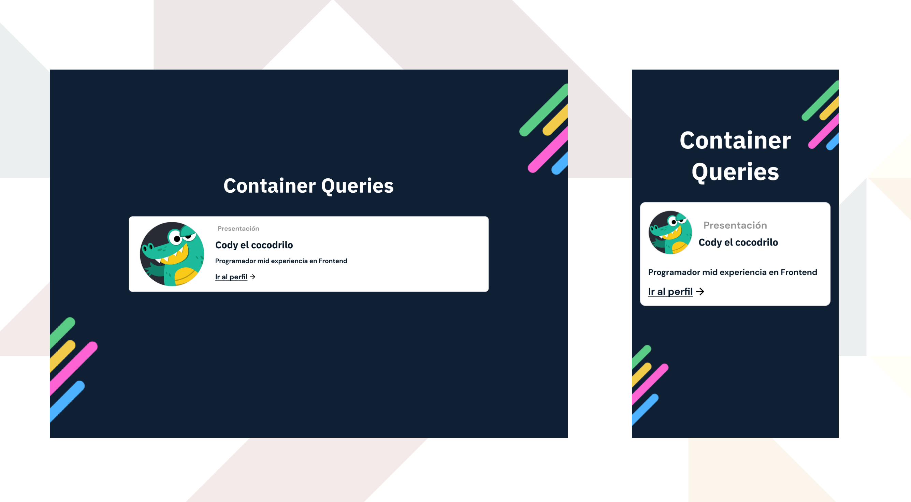

# CSS Container Queries - [Ejercicio Código Facilito]

Este es un ejercicio para el taller 'Crea una página responsiva con nuevas features de CSS' impartido por [Código Facilito](codigofacilito.com/). El objetivo es irse familiarizando con la nueva funcionalidad de Container Queries.

## Table of contents

-   [El reto](#el-reto)
-   [Screenshot](#screenshot)
-   [Links](#links)
-   [Mi proceso](#mi-proceso)
    -   [Construido con](#construido-con)
    -   [Lo que aprendí](#lo-que-aprendí)
-   [Autor](#autor)
-   [Agradecimientos](#agradecimientos)

### El reto

-   El componente debe ajustar su presentación cuando el tamaño de su contenedor sea igual o mayor a 500px, no del viewport del navegador.

### Screenshot



### Links

-   Codepen: https://codepen.io/e_javieer/pen/oNpZONL

## Mi proceso

### Construido con

-   CSS custom properties
-   CSS Grid
-   Enfoque Mobile-first
-   Container Queries
-   [SASS](https://sass-lang.com/) - Preprocesador CSS Preprocessor

### Lo que aprendí

Me familiaricé un poco más con los Container Queries y cómo uno también debe tener presente la estructura de HTML para poder trabajar con esta característica (la propiedad `contain` o `container-type` debe ir en el elemento padre y los cambios se aplicaran a sus hijos).

Tuve que color las propiedades `container-name` y `container-type` por separado porque, por alguna razón, el shorthand de `contain` no me funcionaba.

```CSS
.card {
  container-name: card;
  container-type: inline-size;
}
```

A diferencia de CSS Grid, el elemento padré de Container Queries no recibe cambios solo los hijos y es un error en el que se puede caer facilmente. Para aplicar esos cambios se usa la regla `@container` seguido del nombre que se le haya asignado en `container-name`:

```CSS
@container card (min-width: 500px) {
  .card__wrapper {
    grid-template-areas: "image header" "image body";
  }
}
```

## Autor

-   Frontend Mentor - [@Javieer57](https://www.frontendmentor.io/profile/Javieer57)
-   Github - [@Javieer57](https://github.com/Javieer57)
-   Codepen - [@e_javieer](https://codepen.io/e_javieer)

## Agradecimientos

A [Código Facilito](codigofacilito.com/) por impartir el taller y explicar fácilmente cómo trabajar con este nuevo comportamiento de CSS.
